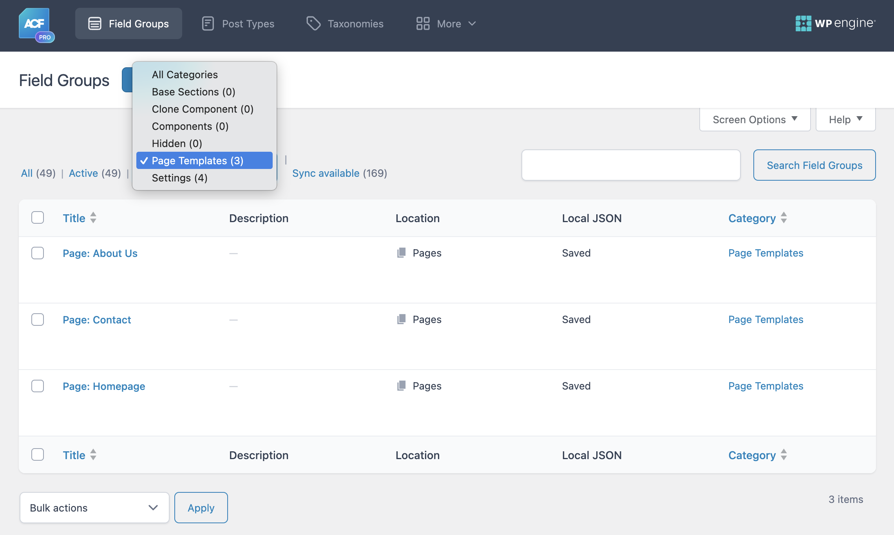
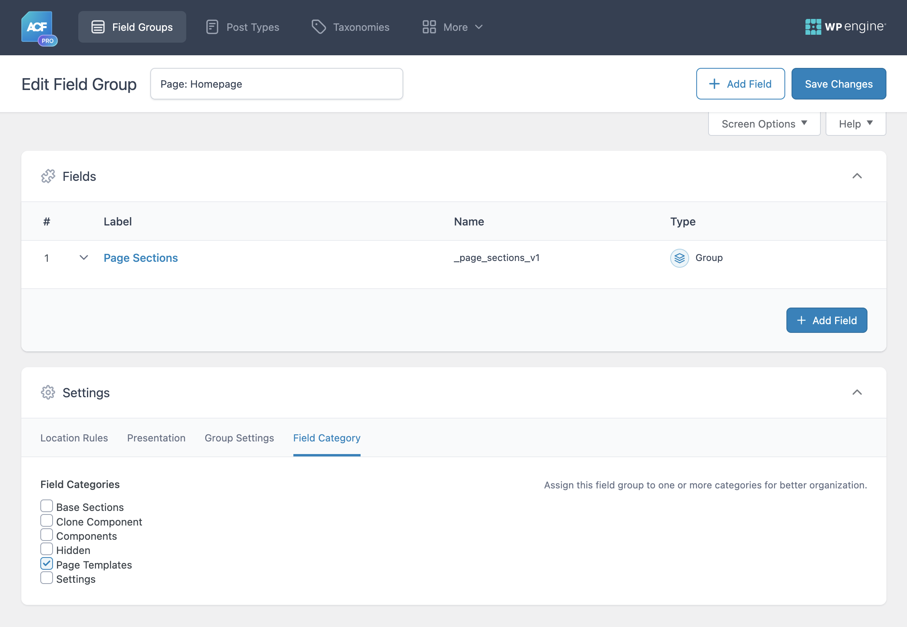
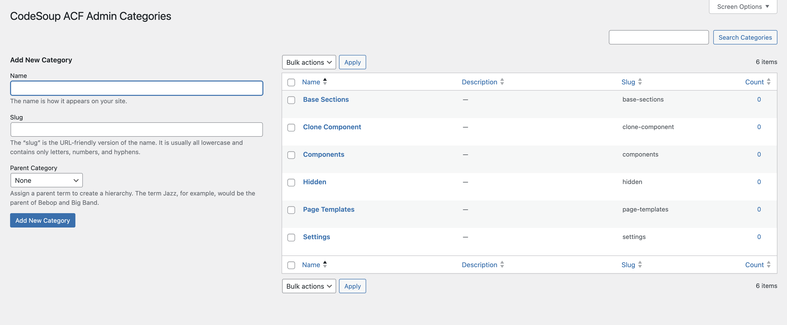

# CodeSoup ACF Admin Categories

CodeSoup ACF Admin Categories extends the Advanced Custom Fields plugin by adding a custom taxonomy system that allows you to categorize and organize your field groups. This makes it easier to manage large numbers of field groups by providing filtering, sorting, and visual organization tools.



### Use Cases

- **Large Projects**: Organize field groups by project sections (Header, Footer, Content, etc.)
- **Development Workflow**: Separate field groups by development status (Active, Testing, Deprecated)

## Requirements

- WordPress 6.0 or higher
- PHP 8.1 or higher
- Advanced Custom Fields (ACF) Pro or Free version

## Installation

### Via WordPress Admin (Recommended)

1. Download the plugin ZIP file from the [releases page](https://github.com/code-soup/acf-admin-categories/releases)
2. Navigate to **Plugins > Add New > Upload Plugin**
3. Choose the downloaded ZIP file and click **Install Now**
4. Activate the plugin through the **Plugins** menu

No additional configuration required. The plugin includes a built-in autoloader and works out of the box.

### Via Composer (Theme Integration)

```bash
composer require codesoup/acf-admin-categories
```

Load the plugin from your theme's `functions.php`:

```php
// Load ACF Admin Categories plugin
$acf_categories = get_template_directory() . '/vendor/codesoup/acf-admin-categories/index.php';
if ( file_exists( $acf_categories ) ) {
    require_once $acf_categories;

    // Configure plugin assets URL for Composer installation
    add_filter( 'codesoup_acf_admin_categories_plugin_dir_url', function( $base_url ) {
        return get_stylesheet_directory_uri() . '/vendor/codesoup/acf-admin-categories';
    });
}
```

**Note:** The plugin automatically uses your theme's Composer autoloader when available, or falls back to its own PSR-4 autoloader.

### Manual Installation

1. Download the plugin files
2. Upload the `acf-admin-categories` folder to your `/wp-content/plugins/` directory
3. Activate the plugin through the **Plugins** menu in WordPress

## Usage

### Creating Field Categories

1. Navigate to **Custom Fields > Field Categories** in your WordPress admin
2. Click **Add New Category**
3. Enter a name and optional description for your category
4. Click **Add New Category** to save

### Assigning Categories to Field Groups

1. Edit any ACF Field Group
2. Click the **Field Category** tab in the field group settings
3. Check the categories you want to assign to this field group
4. Save the field group

### Filtering and Sorting Field Groups

1. Go to **Custom Fields > Field Groups**
2. Use the category dropdown filter above the list to filter by specific categories
3. Click on any category name in the **Category** column to filter by that category
4. Click the **Category** column header to sort field groups alphabetically by category name

### Managing Categories

- **Edit Categories**: Go to **Custom Fields > Field Categories** to edit existing categories
- **Hierarchical Structure**: Create parent/child relationships between categories
- **Bulk Management**: Use WordPress's built-in bulk actions for category management

## Features

- **Categorize Field Groups**: Organize ACF field groups with custom categories
- **Hierarchical Categories**: Create parent/child category relationships
- **Dropdown Filtering**: Quick filter field groups by category
- **Sortable Column**: Click column header to sort by category name alphabetically
- **Click-to-Filter**: Click category name in list to filter instantly
- **Multiple Categories**: Assign multiple categories to single field group
- **Zero Dependencies**: No external packages required - works standalone
- **Composer Ready**: Install via Composer or WordPress plugin directory
- **Auto-Migration**: Automatically migrates existing data on plugin update

## Screenshots

1. **Filter and Sort Field Groups** - Filter field groups by category using dropdown, click category names to filter, and sort alphabetically by clicking column header
   

2. **Category Assignment** - Assign categories directly from field group settings using the Field Category tab
   

3. **Category Management** - Create and manage your field group categories with hierarchical support
   

## Changelog

See [CHANGELOG.md](CHANGELOG.md) for detailed version history.

## Support

Please use [GitHub Issues](https://github.com/code-soup/acf-admin-categories/issues) to submit any bugs or feature requests.

## License

This project is licensed under the GPL v3 or later - see the [LICENSE.txt](LICENSE.txt) file for details.
